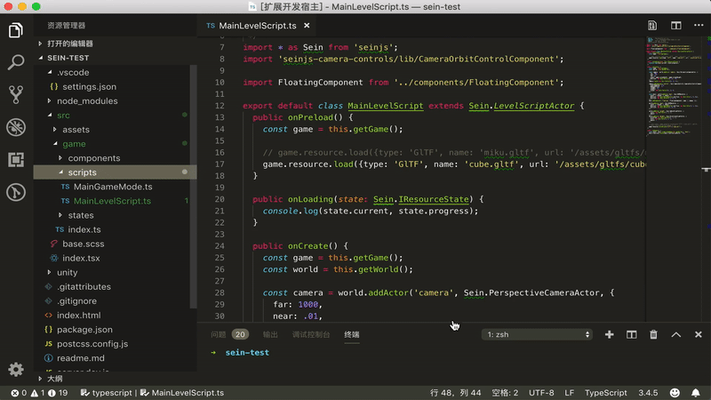

# Sein.js VSCode Extension

VSCode extension for Sein.js

## Features

### Create Sein.js Class files from Base Classes:

You can use this extension to create your Sein.js class from Base Classes.



## Requirements

```bash
npm i seinjs --save
```

## Extension Settings

This extension contributes the following settings:

* `seinjs.fields.author`: Custom field in generated file: __author__
* `seinjs.fields.email`: Custom field in generated file: __email__
* `seinjs.fields.custom`: Custom field in generated file: __custom__
